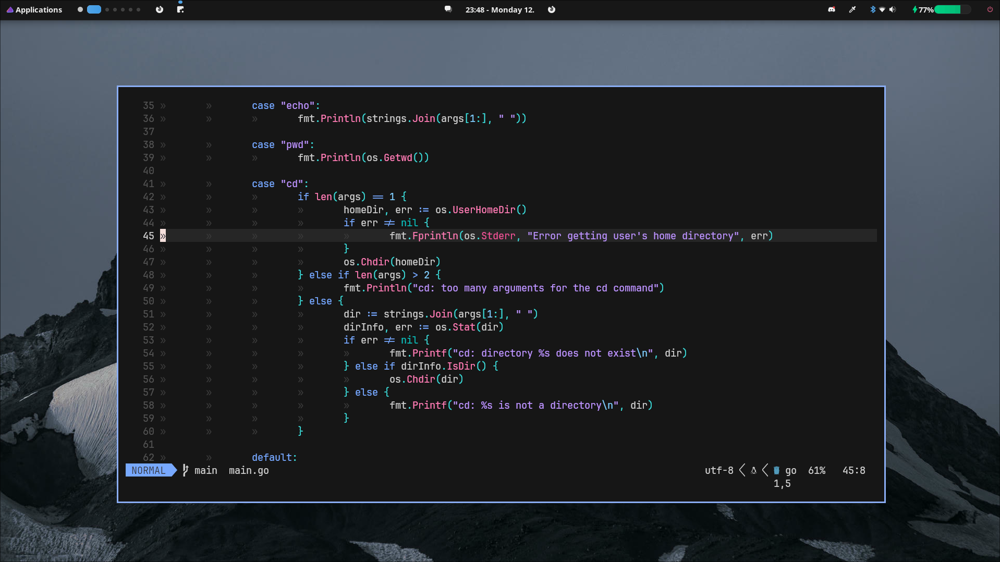

<h1 align="center">Dotfiles</h1>



### Installation
```
git clone https://github.com/retrovoxel/dotfiles ~/.dotfiles
cd .dotfiles
stow .
```

### Programs
- OS: [Arch Linux](https://archlinux.org/)
- WM: [Hyprland](https://hyprland.org/)
- Shell: [Fish](https://fishshell.com/)
- Terminal: [Kitty](https://sw.kovidgoyal.net/kitty/)
- Bar: [Ags](https://github.com/aylur/ags)
- Launcher: [Rofi](https://github.com/davatorium/rofi)
- Editor: [Neovim](https://neovim.io/)
- Colorscheme: [catppuccin mocha](https://github.com/catppuccin/catppuccin) & [oxocarbon](https://github.com/nyoom-engineering/oxocarbon.nvim)
- Font: [Iosevka](https://github.com/be5invis/Iosevka) & [JetbrainsMono Nerd](https://www.jetbrains.com/lp/mono/)

### Acknowledgements
- [Aylur](https://github.com/aylur) for their ags configurations
